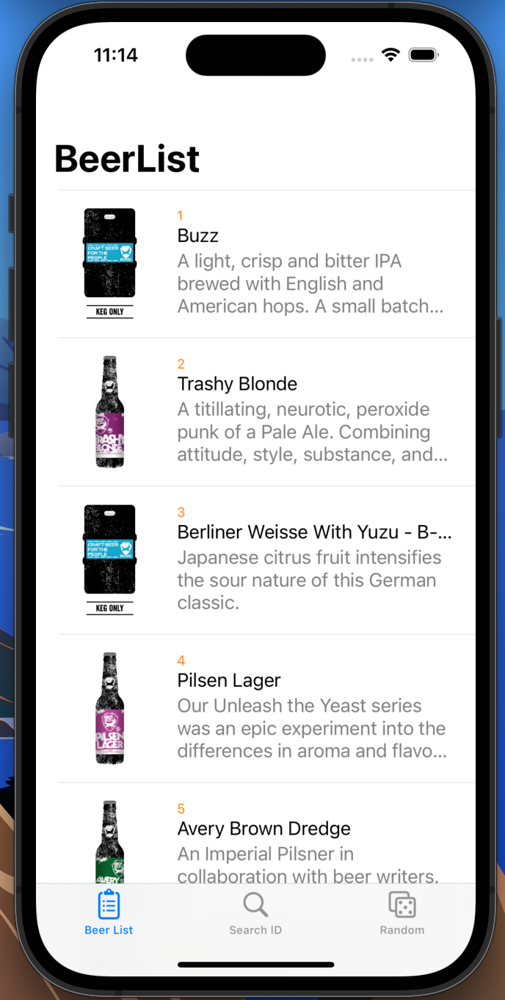
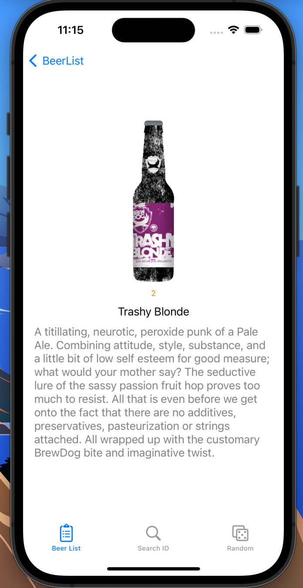
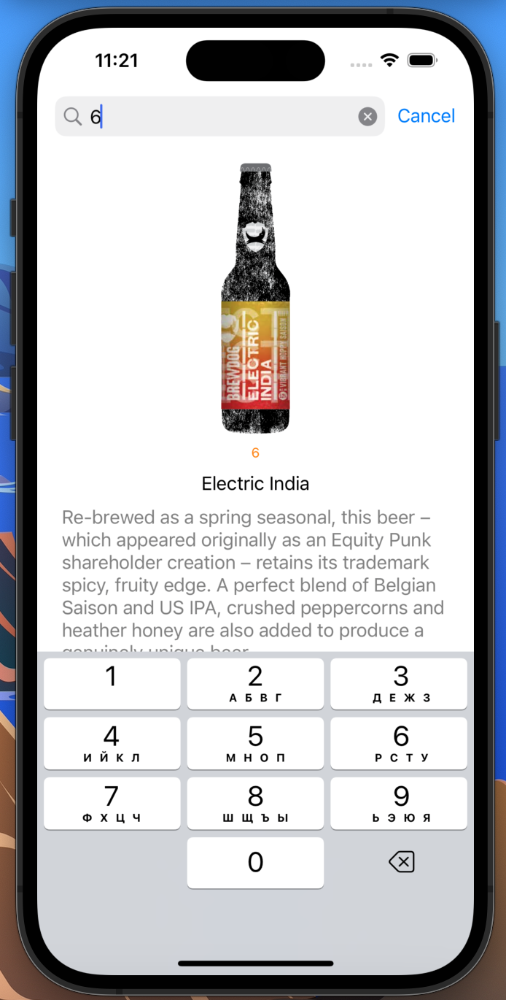
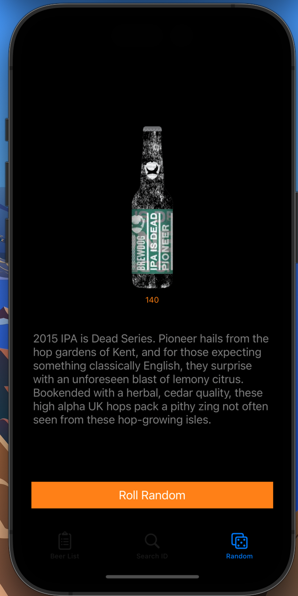

# BeerList-MVC
Application for search beer with Swift MVC design pattern.

## API

- [Beer API](https://punkapi.com/documentation/v2)

## Screenshots

| List | Detail | Search | Random |
| :--: | :----: | :----: | :----: |
 |  |  |  |

## Shared

Image Download - Kingfisher

Package Management - Cocoapods

UI - SnapKit

Network - URLSession

````
$ pod install
````
## 💕 THANK YOU FOR YOUR ATTENTION
